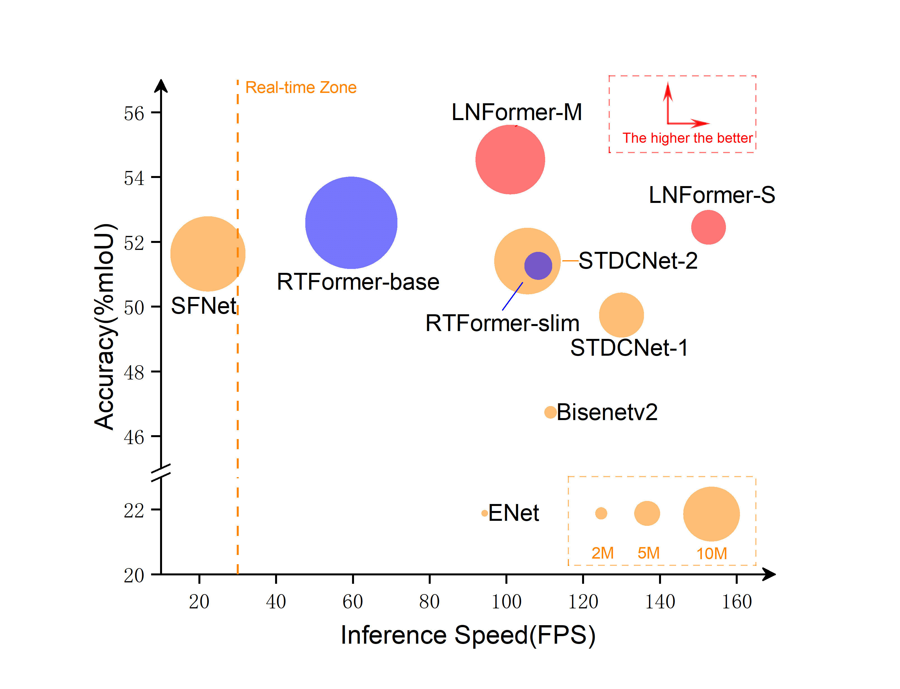

# LNFormer:Lightweight Design for Nighttime Semantic Segmentation with Transformer

Achieve state-of-the-art trade-offs between accuracy and speed on the Nightcity dataset without using inference acceleration (e.g. tensorRT)!

The overall architecture of our methods.

## Usage

Our work was implemented based on paddle

- The code is tested on python3.7 and paddle 2.4.0
- The code is modified from paddleseg https://github.com/PaddlePaddle/PaddleSeg

## Notice

The code for the project is being put together and will be released shortly.

